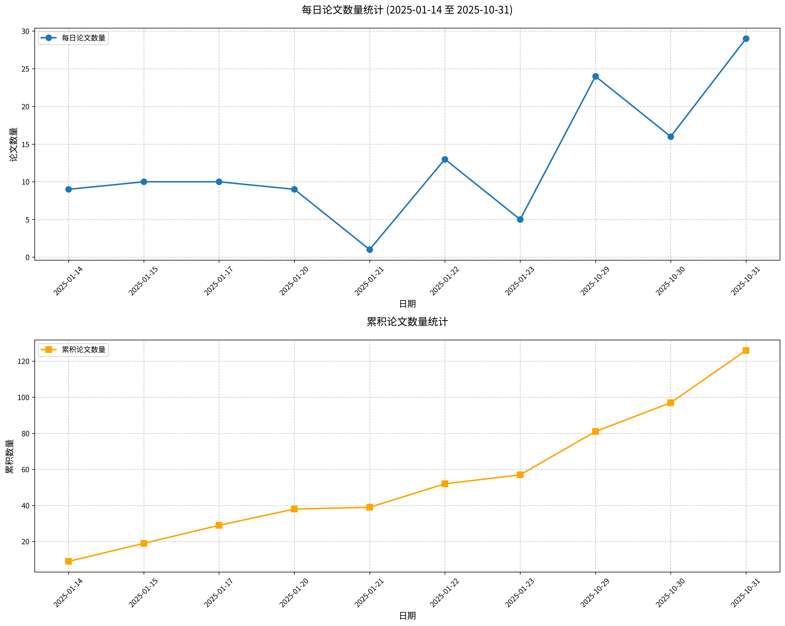

#  Hugging Face 2025-10-29 论文日报

## 📊 今日论文统计
- 总论文数：24
- 热门领域：GPT, Vision, Transformer, RL, LLM

## 📝 论文详情

### 1. InteractComp：基于模糊查询的搜索智能体评估框架

**原文标题：** InteractComp: Evaluating Search Agents With Ambiguous Queries

**摘要：**
语言智能体在网络搜索与信息检索领域展现出显著潜力。然而现有搜索智能体均假设用户查询是完整且明确的，这与实际场景中用户常以需经交互澄清的不完整查询为起点的现实相悖。当前多数智能体缺乏搜索过程中的交互机制，且现有基准无法有效评估此项能力。为填补这一空白，我们提出InteractComp基准，专门用于评估搜索智能体能否识别查询模糊性并在搜索过程中主动交互以解决问题。遵循"易于验证、交互消歧"的原则，我们通过目标-干扰项方法构建了涵盖9个领域的210道专家评审问题，这些问题均存在必须通过交互才能化解的真实模糊性。对17个模型的评估揭示出惊人缺陷：最佳模型仅达到13.73%的准确率（完整上下文条件下可达71.50%），暴露出系统性的过度自信而非推理能力不足。强制交互策略带来显著效果提升，证明现有策略未能有效激发潜在能力。纵向分析表明，在搜索性能提升七倍的同时，交互能力在15个月内持续停滞，这揭示了重要研究盲区。这种发展停滞与搜索任务固有的即时反馈特性，使得InteractComp成为评估和训练搜索智能体交互能力的宝贵资源。代码已发布于https://github.com/FoundationAgents/InteractComp。

**论文链接：** [HuggingFace](https://huggingface.co/papers/2510.24668) | [arXiv](https://arxiv.org/abs/2510.24668)

---

### 2. 通义深度研究技术报告

**原文标题：** Tongyi DeepResearch Technical Report

**摘要：**
本文介绍通义深度研究——一种专为长周期深度信息检索研究任务设计的智能体大语言模型。为激发自主深度研究能力，该模型通过端到端训练框架开发，融合智能体中期训练与后期训练，实现跨复杂任务的可扩展推理与信息检索。我们设计了高度可扩展的全自动数据合成流程，无需依赖高成本人工标注即可支撑全训练阶段。通过为各阶段构建定制化交互环境，系统确保了全流程稳定一致的交互体验。通义深度研究模型总参数量达305亿，每令牌仅激活33亿参数，在包括"人类终极考试"、BrowseComp、BrowseComp-ZH、WebWalkerQA、xbench-DeepSearch、FRAMES及xbench-DeepSearch-2510等一系列智能体深度研究基准测试中均达到最先进性能。我们开源模型、框架及完整解决方案，以赋能学术社区。

**论文链接：** [HuggingFace](https://huggingface.co/papers/2510.24701) | [arXiv](https://arxiv.org/abs/2510.24701)

---

### 3. AgentFold：具有前瞻性上下文管理能力的长周期网络智能体

**原文标题：** AgentFold: Long-Horizon Web Agents with Proactive Context Management

**摘要：**
基于大语言模型的网络智能体在信息检索领域展现出巨大潜力，但其在长周期任务中的效能受到上下文管理固有矛盾的制约。主流基于ReAct框架的智能体因积累大量噪声原始历史记录而面临上下文饱和问题，而固定式全历史摘要方法则可能导致关键细节的不可逆丢失。针对这些挑战，我们提出AgentFold——一种以前瞻性上下文管理为核心的新型智能体范式，其设计灵感源自人类回顾性巩固的认知机制。AgentFold将上下文视为可主动塑形的动态认知工作区，而非被动填充的日志记录。在每个决策步骤中，该系统通过习得的“折叠”操作对历史轨迹进行多尺度管理：既可执行细粒度压缩以保留至关重要的微观细节，也能实施深度整合以抽象化完整的多步骤子任务。在权威基准测试中的表现令人瞩目：仅通过简单的监督微调（无需持续预训练或强化学习），我们的AgentFold-30B-A3B智能体在BrowseComp上达到36.2%的准确率，在BrowseComp-ZH上达到47.3%。值得关注的是，该性能不仅超越或匹配了规模显著更大的开源模型（如DeepSeek-V3.1-671B-A37B），更超越了OpenAI o4-mini等领先的专有智能体系统。

**论文链接：** [HuggingFace](https://huggingface.co/papers/2510.24699) | [arXiv](https://arxiv.org/abs/2510.24699)

---

### 4. Game-TARS：面向可扩展通用型多模态游戏智能体的预训练基础模型

**原文标题：** Game-TARS: Pretrained Foundation Models for Scalable Generalist
  Multimodal Game Agents

**摘要：**
本文提出Game-TARS——一种基于人类标准键鼠输入构建的统一可扩展动作空间的通用游戏智能体。与基于API或图形界面的方法不同，该范式支持跨操作系统、网页和模拟游戏等异构领域的大规模持续预训练。Game-TARS通过包含多样化轨迹与多模态数据的超过5000亿标记进行预训练，其核心技术包含：用于降低因果混淆的衰减持续损失函数，以及平衡推理深度与计算成本的高效稀疏思维策略。实验表明：在开放世界《我的世界》任务中，Game-TARS的成功率较先前最优模型提升约2倍；在未知网页3D游戏中接近人类新手的泛化能力；在FPS基准测试中超越GPT-5、Gemini-2.5-Pro和Claude-4-Sonnet。训练阶段与测试阶段的扩展实验结果证实，统一动作空间在跨游戏与多模态数据扩展时能持续提升性能。我们的研究证明，基于简洁可扩展的动作表示与大规模预训练相结合，为构建具有广泛计算机使用能力的通用智能体提供了可行路径。

**论文链接：** [HuggingFace](https://huggingface.co/papers/2510.23691) | [arXiv](https://arxiv.org/abs/2510.23691)

---

### 5. RoboOmni：全模态情境下的主动式机器人操控

**原文标题：** RoboOmni: Proactive Robot Manipulation in Omni-modal Context

**摘要：**
多模态大语言模型的最新进展推动了机器人操控领域视觉-语言-动作模型的快速发展。尽管现有方法在许多场景中表现有效，但它们主要依赖显式指令，而在现实人机交互中人类很少直接发出指令。要实现高效协作，机器人需要具备主动推断用户意图的能力。本研究提出跨模态情境指令新范式，通过语音对话、环境声音和视觉线索而非显式命令来推导意图。针对这一新范式，我们提出RoboOmni——基于端到端全模态大语言模型的感知-思考-对话-执行框架，统一实现意图识别、交互确认和动作执行。该框架通过时空融合听觉与视觉信号实现鲁棒的意图识别，并支持直接语音交互。为解决机器人主动意图识别训练数据缺失的问题，我们构建了包含14万条操作序列、5000+说话人、2400种事件声音、640种背景和六类情境指令的OmniAction数据集。仿真与真实环境实验表明，RoboOmni在成功率、推理速度、意图识别准确率和主动辅助能力方面均优于基于文本和自动语音识别的基线方法。

**论文链接：** [HuggingFace](https://huggingface.co/papers/2510.23763) | [arXiv](https://arxiv.org/abs/2510.23763)

---

### 6. 基于度量路径的均匀离散扩散视频生成方法

**原文标题：** Uniform Discrete Diffusion with Metric Path for Video Generation

**摘要：**
连续空间视频生成技术发展迅猛，而离散方法因误差累积和长上下文不一致性问题发展滞后。本研究重新审视离散生成建模，提出具有度量路径的均匀离散扩散框架（URSA），这一简洁而强大的框架通过可扩展视频生成弥合了与连续方法的差距。该框架核心将视频生成任务定义为离散时空标记的迭代全局优化过程，集成了两个关键设计：线性化度量路径和分辨率相关时间步偏移机制。这些设计使URSA能够高效扩展至高分辨率图像合成和长时序视频生成，同时显著减少推理步数。此外，我们提出异步时序微调策略，将插值和图像到视频生成等多种任务统一于单一模型中。在具有挑战性的视频与图像生成基准测试上的大量实验表明，URSA持续超越现有离散方法，并达到与最先进连续扩散方法相媲美的性能。代码与模型已发布于https://github.com/baaivision/URSA

**论文链接：** [HuggingFace](https://huggingface.co/papers/2510.24717) | [arXiv](https://arxiv.org/abs/2510.24717)

---

### 7. 图像编辑中的群组相对注意力引导机制

**原文标题：** Group Relative Attention Guidance for Image Editing

**摘要：**
基于Transformer架构的扩散模型在图像编辑领域近期取得了快速发展。然而，现有编辑方法往往缺乏对编辑程度的有效控制，限制了其实现更精细化编辑效果的能力。为解决这一局限性，我们深入研究了DiT模型中的多头注意力机制，发现查询向量与键向量共享仅与网络层相关的偏置向量。我们将该偏置向量解释为模型固有的编辑行为特征，而各表征向量与其对应偏置之间的差值则编码了具体内容的编辑信号。基于这一发现，我们提出了群组相对注意力引导方法——一种通过重新加权不同表征向量的差值来调节模型对输入图像与编辑指令的相对关注度的创新方案，无需任何参数调优即可实现连续、细粒度的编辑强度控制。在现有图像编辑框架上进行的大量实验表明，GRAG方法仅需四行代码即可实现集成，并能持续提升编辑质量。与常用的无分类器引导技术相比，GRAG能够实现更平滑、更精确的编辑程度控制。我们的代码将在https://github.com/little-misfit/GRAG-Image-Editing 发布。

**论文链接：** [HuggingFace](https://huggingface.co/papers/2510.24657) | [arXiv](https://arxiv.org/abs/2510.24657)

---

### 8. OSWorld-MCP：计算机应用智能体中MCP工具调用能力的基准测试研究

**原文标题：** OSWorld-MCP: Benchmarking MCP Tool Invocation In Computer-Use Agents

**摘要：**
随着决策与推理能力的进步，多模态智能体在计算机应用场景中展现出巨大潜力。现有评估主要关注图形用户界面交互能力，而对基于模型上下文协议（MCP）实现的工具调用能力评估尚存空白。将集成工具调用的智能体与仅评估GUI交互的智能体进行对比存在本质不公。本研究提出OSWorld-MCP——首个在真实环境下全面公正评估计算机应用智能体工具调用、GUI操作与决策能力的基准体系。我们设计了创新的自动化代码生成流程来创建工具，并将其与现有工具精选集相结合。通过严格人工验证最终获得158个高质量工具（覆盖7类常见应用），每个工具均通过功能性、实用性与多场景适用性三重检验。基于OSWorld-MCP对前沿多模态智能体的广泛测试表明：MCP工具能显著提升任务成功率（如OpenAI o3在15步时从8.3%提升至20.4%，Claude 4 Sonnet在50步时从40.1%提升至43.3%），印证了评估工具调用能力的重要性。然而即便最强模型的工具调用率也相对较低（仅36.3%），既揭示了改进空间，也凸显了本基准的前沿性。通过明确量化MCP工具使用能力，OSWorld-MCP深化了对多模态智能体的认知，为复杂工具辅助环境下的性能评估确立了新标准。相关代码、环境与数据已公开于https://osworld-mcp.github.io。

**论文链接：** [HuggingFace](https://huggingface.co/papers/2510.24563) | [arXiv](https://arxiv.org/abs/2510.24563)

---

### 9. MoE中的路由机制研究：基于显式路由指导的扩散变换器规模化扩展

**原文标题：** Routing Matters in MoE: Scaling Diffusion Transformers with Explicit
  Routing Guidance

**摘要：**
混合专家模型已成为在保持计算效率的同时扩展模型容量的重要范式。尽管该范式在大型语言模型中取得显著成功，但现有将MoE应用于扩散变换器的尝试收效甚微。我们认为这一差距源于语言与视觉标记的本质差异：语言标记具有语义密集性和显著的标记间差异性，而视觉标记则呈现空间冗余性和功能异质性，这阻碍了视觉MoE中的专家专业化。为此，我们提出ProMoE——一个具有显式路由指导的双阶段路由器的MoE框架，该框架通过功能角色划分促进专家专业化。具体而言，该指导机制通过条件路由将图像标记按功能角色划分为条件集和无条件集，并借助基于语义内容的可学习原型，通过原型路由优化条件图像标记的分配。此外，原型路由实现的潜在空间基于相似度的专家分配，为融入显式语义指导提供了天然机制，我们验证了此类指导对视觉MoE至关重要。基于此，我们提出路由对比损失函数，显式增强原型路由过程，促进专家内部一致性与专家间多样性。在ImageNet基准上的大量实验表明，ProMoE在整流流和DDPM训练目标下均优于现有最优方法。代码与模型将公开发布。

**论文链接：** [HuggingFace](https://huggingface.co/papers/2510.24711) | [arXiv](https://arxiv.org/abs/2510.24711)

---

### 10. WebLeaper：通过支持信息富集式搜索增强网络代理的效能与效率

**原文标题：** WebLeaper: Empowering Efficiency and Efficacy in WebAgent via Enabling
  Info-Rich Seeking

**摘要：**
基于大语言模型的智能体已成为解决开放式问题的变革性方法，其中信息搜索作为核心能力支撑着自主推理与决策。尽管现有研究主要聚焦于提升检索深度，但我们发现当前信息搜索智能体普遍存在搜索效率低下的问题，这反过来制约了整体性能。造成该低效现象的关键因素在于训练任务中目标实体的稀疏性，限制了智能体学习并泛化高效搜索行为的机会。为应对这些挑战，我们提出WebLeaper框架，通过构建高覆盖度的信息搜索任务并生成高效解决方案轨迹来解决问题。我们将信息搜索建模为树状结构推理问题，使更多目标实体能够嵌入受限上下文中。借助精选的维基百科表格，我们提出基础型、联合型及反向联合型三种任务生成变体，系统提升信息搜索的效率和效果。最后，我们通过筛选同时具备准确性与高效性的训练轨迹，确保模型在正确性和搜索性能上均得到优化。在五大信息搜索基准测试（BrowserComp、GAIA、xbench-DeepSearch、WideSearch和Seal-0）上进行的广泛实验表明，我们的方法在基础场景和综合场景下均能持续超越强基线模型，在效能与效率方面实现双重提升。

**论文链接：** [HuggingFace](https://huggingface.co/papers/2510.24697) | [arXiv](https://arxiv.org/abs/2510.24697)

---

### 11. 合成数据在细粒度搜索代理监督中的再利用

**原文标题：** Repurposing Synthetic Data for Fine-grained Search Agent Supervision

**摘要：**
基于大语言模型的搜索代理正越来越多地使用以实体为中心的合成数据进行训练，以解决复杂的知识密集型任务。然而，当前主流的训练方法（如组相对策略优化）丢弃了这些丰富的实体信息，转而依赖稀疏的、基于结果的奖励机制。这一关键缺陷使得模型无法区分具有参考价值的"近似正确"样本（即推理过程基本正确但最终答案存在瑕疵的样本）与完全错误的样本，从而导致有价值学习信号的丢失。我们通过利用训练过程中被丢弃的实体信息来解决这一问题。实证分析表明，智能体在推理过程中识别出的真实实体数量与最终答案准确率之间存在显著正相关。基于这一发现，我们提出了实体感知的组相对策略优化框架——一种创新的、能够构建密集实体感知奖励函数的方法。该框架根据错误样本的实体匹配率为其分配相应比例的奖励，使模型能够从"近似正确"样本中有效学习。在多样化问答系统和深度研究基准测试上的实验表明，实体感知的组相对策略优化持续且显著优于基准方法。进一步分析显示，该框架不仅实现了更高的准确率，还诱导出更高效的推理策略——所需工具调用次数更少，这证明其在搜索代理对齐方面采用了更有效且样本效率更高的方法。

**论文链接：** [HuggingFace](https://huggingface.co/papers/2510.24694) | [arXiv](https://arxiv.org/abs/2510.24694)

---

### 12. STAR-Bench：探索作为音频4D智能的深度时空推理能力

**原文标题：** STAR-Bench: Probing Deep Spatio-Temporal Reasoning as Audio 4D
  Intelligence

**摘要：**
尽管多模态大语言模型与大型音频-语言模型发展迅速，现有音频基准大多仅检验可从文本描述中还原的语义特征，这掩盖了模型在细粒度感知推理方面的缺陷。我们正式提出"音频4D智能"概念，即对声音在时间维度和三维空间中动态变化的推理能力，并引入STAR-Bench进行量化评估。该基准集成了基础听觉感知场景（包含绝对与相对两种判别机制下的六类属性）与整体时空推理场景，后者涵盖连续/离散过程的片段重组任务，以及静态定位、多源关联和动态轨迹三类空间任务。我们通过两种方法构建高质量数据：基础任务采用程序化合成与物理仿真音频；整体数据经过四阶段流程，包括人工标注与基于人类表现的最终筛选。相较于现有基准仅使准确率微降的情况，STAR-Bench引发更显著的性能落差（时序任务-31.5%，空间任务-35.2%），证明其聚焦于语言难以描述的感知线索。对19个模型的评估显示：相比人类表现存在明显差距，且呈现能力分层——闭源模型受限于细粒度感知，开源模型则在感知、知识与推理层面全面落后。STAR-Bench为开发具有更扎实物理世界认知能力的新一代模型提供了关键洞见与明确路径。

**论文链接：** [HuggingFace](https://huggingface.co/papers/2510.24693) | [arXiv](https://arxiv.org/abs/2510.24693)

---

### 13. AgentFrontier：通过最近发展区引导的数据合成拓展大语言模型智能体的能力边界

**原文标题：** AgentFrontier: Expanding the Capability Frontier of LLM Agents with
  ZPD-Guided Data Synthesis

**摘要：**
在大语言模型智能体能力边界任务上进行训练是解锁高级推理能力的关键。我们提出一种受最近发展区教育理论启发的数据合成方法，将该边界定义为大语言模型无法独立解决但能在引导下掌握的任务。为实现这一目标，我们开发了AgentFrontier引擎——一个自动化流程，能够精准合成位于大语言模型最近发展区内的高质量跨学科数据。该引擎既支持知识密集型数据的持续预训练，也支持复杂推理任务的针对性后训练。基于同一框架，我们构建了ZPD测评——一个动态自动化基准，专门用于评估智能体在边界任务上的表现。通过使用合成数据训练的AgentFrontier-30B-A3B模型，在"人类终极考试"等高要求基准测试中取得了最先进成果，甚至超越了部分领先的专有智能体。本研究证明，以最近发展区为指导的数据合成方法，为构建更强大语言模型智能体提供了可扩展的有效路径。

**论文链接：** [HuggingFace](https://huggingface.co/papers/2510.24695) | [arXiv](https://arxiv.org/abs/2510.24695)

---

### 14. 潜在画板：通过视觉草图激发多模态大语言模型的多模态推理能力

**原文标题：** Latent Sketchpad: Sketching Visual Thoughts to Elicit Multimodal
  Reasoning in MLLMs

**摘要：**
尽管多模态大语言模型在视觉理解方面表现出色，但在需要视觉规划与想象力的复杂场景中往往表现不佳。受人类通过草图作为视觉思维来发展和交流想法的启发，我们提出了潜在画板框架，为多模态大语言模型配备内部视觉草稿本。传统上，多模态大语言模型的内部视觉表征主要局限于感知理解。我们重新定位其功能，在不影响推理能力的前提下支持生成式视觉思维。基于前沿多模态大语言模型，我们的方法将视觉生成直接整合到其原生自回归推理过程中，使模型能够将文本推理与视觉潜在表征的生成交错进行。这些潜在表征既能引导内部思维过程，也可通过解码生成可解释的草图图像。为实现这一目标，我们引入两个核心组件：上下文感知视觉头通过自回归方式生成视觉表征，预训练草图解码器则将这些表征渲染为人类可理解的图像。我们在新构建的迷宫规划数据集上对该框架进行评估。实验结果表明，潜在画板在不同多模态大语言模型中均能取得与骨干模型相当或更优的推理性能，并成功泛化至Gemma3和Qwen2.5-VL等前沿模型。通过将模型的文本推理能力拓展至视觉思维领域，我们的框架为人机交互的丰富化和应用场景的拓展开辟了新途径。更多细节与资源请访问项目页面：https://latent-sketchpad.github.io/。

**论文链接：** [HuggingFace](https://huggingface.co/papers/2510.24514) | [arXiv](https://arxiv.org/abs/2510.24514)

---

### 15. Critique-RL：基于两阶段强化学习的评述语言模型训练方法

**原文标题：** Critique-RL: Training Language Models for Critiquing through Two-Stage
  Reinforcement Learning

**摘要：**
训练具备评述能力的语言模型以评估模型输出并提供反馈，是提升大语言模型在复杂推理任务表现的有效途径。然而现有方法通常依赖更强监督源进行评述数据标注。为此，我们提出Critique-RL——一种无需强监督即可开发评述语言模型的在线强化学习方法。该方法采用双智能体交互范式：执行者生成初始回答，评述者提供反馈，执行者据此优化回答。我们首先发现，仅依靠执行者输出产生的间接奖励信号进行强化学习优化，往往导致评述模型存在缺陷：其帮助性（即提供建设性反馈）虽有所提升，但判别能力（即判断回答质量优劣）仍然不足，最终导致性能提升有限。为突破此局限，Critique-RL采用两阶段优化策略：第一阶段通过基于规则的直接奖励信号强化评述者的判别能力；第二阶段引入基于执行者优化效果的间接奖励来提升评述者的帮助性，同时通过适当的正则化手段维持其判别能力。在多任务和多模型的广泛实验表明，Critique-RL能带来显著的性能提升。以Qwen2.5-7B模型为例，其在领域内任务和领域外任务上分别实现了9.02%和5.70%的性能增益，彰显了该方法的应用潜力。

**论文链接：** [HuggingFace](https://huggingface.co/papers/2510.24320) | [arXiv](https://arxiv.org/abs/2510.24320)

---

### 16. VisCoder2：构建多语言可视化编程智能体

**原文标题：** VisCoder2: Building Multi-Language Visualization Coding Agents

**摘要：**
大语言模型近期催生了能够生成、执行及修正可视化代码的编程智能体。然而现有模型因语言覆盖有限、执行可靠性不足且缺乏迭代修正机制，在实际工作流程中往往表现不佳。该领域发展受限于侧重单轮生成和单一语言任务的狭窄数据集与评估基准。为应对这些挑战，我们提出三项互补资源以推进可视化编程智能体发展：VisCode-Multi-679K作为大规模监督数据集，包含67.9万经过验证的可执行可视化样本，涵盖12种编程语言的多轮修正对话；VisPlotBench作为系统化评估基准，具备可执行任务、渲染输出及支持初始生成与多轮自调试的评估方案；最终我们基于VisCode-Multi-679K训练出多语言可视化模型系列VisCoder2。实验表明，VisCoder2显著超越主流开源基线模型，并逼近GPT-4.1等专有模型性能，通过迭代自调试进一步将总体执行通过率提升至82.4%（320亿参数规模），在符号化或依赖编译器的编程语言中表现尤为突出。

**论文链接：** [HuggingFace](https://huggingface.co/papers/2510.23642) | [arXiv](https://arxiv.org/abs/2510.23642)

---

### 17. ParallelMuse：面向深度信息检索的智能体并行思考框架

**原文标题：** ParallelMuse: Agentic Parallel Thinking for Deep Information Seeking

**摘要：**
并行思考通过扩展探索广度，与信息检索智能体的深度探索形成互补，从而进一步提升问题解决能力。然而传统并行思考在此场景下面临两大挑战：因重复从头展开导致的低效性问题，以及在答案生成阶段难以整合长程推理轨迹——有限的上下文容量阻碍了对完整推理过程的充分考量。为解决这些问题，我们提出ParallelMuse这一面向深度信息检索智能体的双阶段范式。第一阶段"功能指定式部分展开"将生成序列划分为功能区域，通过不确定性引导的路径复用与分支策略提升探索效率；第二阶段"压缩推理聚合"利用推理冗余性，对答案推导相关的信息进行无损压缩并合成连贯的最终答案。在多个开源智能体与基准测试上的实验表明，该方法在减少10-30%探索性令牌消耗的同时，最高可实现62%的性能提升。

**论文链接：** [HuggingFace](https://huggingface.co/papers/2510.24698) | [arXiv](https://arxiv.org/abs/2510.24698)

---

### 18. ATLAS：面向多语言预训练、微调及破解多语诅咒的自适应迁移缩放法则

**原文标题：** ATLAS: Adaptive Transfer Scaling Laws for Multilingual Pretraining,
  Finetuning, and Decoding the Curse of Multilinguality

**摘要：**
缩放法则研究长期以来过度聚焦于英语语种，然而最前沿的AI模型明确服务于全球数十亿用户。本研究开展了迄今规模最大的多语言缩放法则实验，累计完成774组多语言训练，覆盖1000万至80亿参数规模、400余种训练语言及48种评估语言。我们提出了适用于单语与多语预训练的自适应迁移缩放法则（ATLAS），其样本外泛化能力较现有缩放法则平均提升超过0.3个R²指标。通过实验分析，我们揭示了多语言学习动态机制、语言间迁移特性以及多语诅咒现象：首先推导出跨语言迁移矩阵，实证测量38×38=1444组语言对的互惠分值；其次建立语言无关的缩放法则，揭示在扩展语言规模时如何优化模型参数与数据配比以保持性能；最后确定了从头预训练与基于多语检查点微调的计算效益临界点。这些发现有望为跨语言缩放法则的民主化奠定科学基础，助力实践者突破英语优先的AI发展范式，实现模型的高效扩展。

**论文链接：** [HuggingFace](https://huggingface.co/papers/2510.22037) | [arXiv](https://arxiv.org/abs/2510.22037)

---

### 19. FunReason-MT技术报告：突破多轮函数调用的复杂性壁垒

**原文标题：** FunReason-MT Technical Report: Overcoming the Complexity Barrier in
  Multi-Turn Function Calling

**摘要：**
函数调用（FC）使大语言模型（LLM）与自主智能体能够对接外部工具，这是解决复杂现实问题的关键能力。随着该能力在先进人工智能系统中日益重要，对高质量多轮训练数据用以开发和完善该能力的需求不容忽视。现有数据合成方法（如随机环境采样或多智能体角色扮演）在现实环境中不足以生成高质量数据。实际挑战主要体现在三个方面：定向模型训练、工具架构隔离和多轮逻辑依赖。为克服这些结构性缺陷，我们提出FunReason-MT——面向现实场景多轮工具使用的新型数据合成框架。该框架通过以下方式突破多轮FC数据的复杂性壁垒：1）采用环境-API图交互收集多样化高质量轨迹；2）通过高级工具-查询合成简化复杂查询构建；3）利用引导式迭代链生成精细思维链。在伯克利函数调用排行榜（BFCLv3）上的评估证明了我们框架的强大性能：基于FunReason-MT生成数据训练的40亿参数模型，在同等规模模型中达到最优性能，超越多数闭源模型。在BFCLv4上的持续性能提升进一步证实，FunReason-MT为智能体学习提供了可靠且稳健的数据支撑。

**论文链接：** [HuggingFace](https://huggingface.co/papers/2510.24645) | [arXiv](https://arxiv.org/abs/2510.24645)

---

### 20. ReplicationBench：人工智能代理能否复现天体物理学研究论文？

**原文标题：** ReplicationBench: Can AI Agents Replicate Astrophysics Research Papers?

**摘要：**
前沿人工智能代理作为科研助手展现出日益广阔的前景，最终或可应用于扩展性开放研究流程。然而要将代理应用于创新性研究，我们首先需要评估其工作的本质忠实度与正确性。为此我们推出ReplicationBench评估框架，通过测试代理能否完整复现天体物理学领域的研究论文来评估其科研辅助能力。天体物理学研究主要依赖档案数据与计算分析而无需现实实验，这为人工智能代理提供了理想的科研测试场。我们将每篇论文解构为若干任务，要求代理复现论文的核心成果，包括实验设置、公式推导、数据分析和代码库重建。每个任务均与论文原作者共同设计，聚焦关键科学结论，从而实现对忠实度（遵循原始方法的程度）与正确性（成果技术准确性）的客观评估。当前最先进的语言模型在ReplicationBench上表现欠佳：最优模型的得分仍低于20%。通过与领域专家联合分析任务执行轨迹，我们发现了科研代理存在丰富多样的失效模式。ReplicationBench建立了首个经专家验证的论文级天体物理研究任务基准，揭示了可推广至其他数据驱动科学领域的代理性能洞见，并为衡量人工智能代理在科学研究中的可靠性提供了可扩展的评估框架。

**论文链接：** [HuggingFace](https://huggingface.co/papers/2510.24591) | [arXiv](https://arxiv.org/abs/2510.24591)

---

### 21. 泛化抑或记忆：面向模式调控的动态解码机制

**原文标题：** Generalization or Memorization: Dynamic Decoding for Mode Steering

**摘要：**
大型语言模型呈现出令人担忧的双重特性：既能实现卓越的泛化能力，又可能对其训练数据产生僵化的逐字记忆。这种不可预测性严重影响了其在高风险应用中的可靠性。本研究提出统一框架以理解、识别并控制这两种不同的推理模式。首先，我们基于信息瓶颈原理构建理论模型，将泛化形式化为对压缩化任务相关表征的学习过程，而将记忆定义为压缩失败的表现。基于该理论，我们开发了动态模式调控技术——一种新型推理时算法，包含两个核心组件：（1）基于因果关系的轻量级线性探测器，用于识别模型对记忆机制的瞬时依赖程度；（2）动态激活导向机制，将模型计算过程引导至预先识别的泛化回路。我们将DMS框架定义为一种自适应自对比解码范式。在推理任务和事实一致性任务上的实验表明，该技术能显著提升逻辑连贯性与事实准确性，从而为增强大型语言模型可靠性提供了理论完备的解决方案。

**论文链接：** [HuggingFace](https://huggingface.co/papers/2510.22099) | [arXiv](https://arxiv.org/abs/2510.22099)

---

### 22. 视觉智能的再思考：基于视频预训练的启示

**原文标题：** Rethinking Visual Intelligence: Insights from Video Pretraining

**摘要：**
大型语言模型（LLM）已证明在大规模预训练条件下，系统能够以极少监督快速适应语言领域的新问题。然而，这种成功尚未有效迁移至视觉领域——包括LLM在内的各类模型仍在组合理解、样本效率和通用问题解决能力方面面临挑战。本研究探索视频扩散模型（VDM）作为弥合这一差距的有效路径。通过对时空数据进行预训练，这类模型获得了对结构与动态的强归纳偏置，我们推测这种特性可支撑广泛的任务适应能力。为验证此假设，我们设计了对照实验：同时为预训练LLM和预训练VDM配备轻量化适配器，使其在各自自然模态下执行任务。在ARC-AGI、ConceptARC、视觉游戏、路径规划和元胞自动机等基准测试中，VDM展现出优于语言模型的数据效率。综合结果表明，视频预训练所提供的归纳偏置为构建视觉基础模型提供了重要推进路径。

**论文链接：** [HuggingFace](https://huggingface.co/papers/2510.24448) | [arXiv](https://arxiv.org/abs/2510.24448)

---

### 23. VL-SAE：基于统一概念集的视觉语言对齐机制解析与增强

**原文标题：** VL-SAE: Interpreting and Enhancing Vision-Language Alignment with a
  Unified Concept Set

**摘要：**
视觉语言表征的对齐机制赋予当前视觉语言模型强大的多模态推理能力。然而由于难以将多模态表征语义映射到统一概念集，该对齐组件的可解释性研究尚属空白。为解决此问题，我们提出稀疏自编码器VL-SAE，其通过隐藏层激活值对视觉语言表征进行编码。隐藏层中每个神经元与由语义相似的图像和文本所表征的概念相关联，从而通过统一概念集实现对这些表征的语义解析。为建立神经元-概念关联，我们在自监督训练中促使语义相似的表征保持一致的神经元激活：首先基于余弦相似度以显式形式实现多模态表征对齐，从而度量其语义相似性；其次构建具有距离编码器和双模态专用解码器的VL-SAE架构，确保语义相似表征的激活一致性。在多个视觉语言模型（如CLIP、LLaVA）上的实验表明，VL-SAE在解析和增强视觉语言对齐方面具有卓越能力。在解析层面，通过对比视觉与语言表征与概念集的语义关联即可理解其对齐机制；在增强层面，通过概念级的视觉语言表征对齐可强化对齐效果，进而提升零样本图像分类和幻觉消除等下游任务性能。代码已发布于https://github.com/ssfgunner/VL-SAE。

**论文链接：** [HuggingFace](https://huggingface.co/papers/2510.21323) | [arXiv](https://arxiv.org/abs/2510.21323)

---

### 24. PartNeXt：面向细粒度分层三维部件理解的下一代数据集

**原文标题：** PartNeXt: A Next-Generation Dataset for Fine-Grained and Hierarchical 3D
  Part Understanding

**摘要：**
在构件级别理解物体是推动计算机视觉、图形学和机器人技术发展的基础。尽管PartNet等数据集推动了三维部件理解的发展，但其对无纹理几何体和专家依赖型标注的依赖限制了可扩展性和可用性。我们推出PartNeXt这一新一代数据集，通过包含超过23,000个高质量带纹理三维模型（涵盖50个类别并标注细粒度分层部件标签）来解决这些缺陷。我们在两个任务上对PartNeXt进行基准测试：（1）类别无关部件分割——现有前沿方法（如PartField、SAMPart3D）在细粒度和叶级部件识别方面表现不佳；（2）三维部件中心问答——作为面向三维大语言模型的新基准，该任务揭示了开放词汇部件定位能力的显著不足。此外，使用PartNeXt训练Point-SAM相比PartNet带来显著性能提升，印证了该数据集更优的质量与多样性。通过结合可扩展标注、纹理感知标签和多任务评估，PartNeXt为结构化三维理解研究开辟了新途径。

**论文链接：** [HuggingFace](https://huggingface.co/papers/2510.20155) | [arXiv](https://arxiv.org/abs/2510.20155)

---

## 🔍 关键词云图

## 📈 近期论文趋势

## 🎙️ 语音播报
- [收听今日论文解读](../audio/2025-10-29_daily_papers.mp3)

## 📱 订阅渠道
- GitHub: [hf-daily-paper-newsletter-chinese](https://github.com/2404589803/hf-daily-paper-newsletter-chinese)