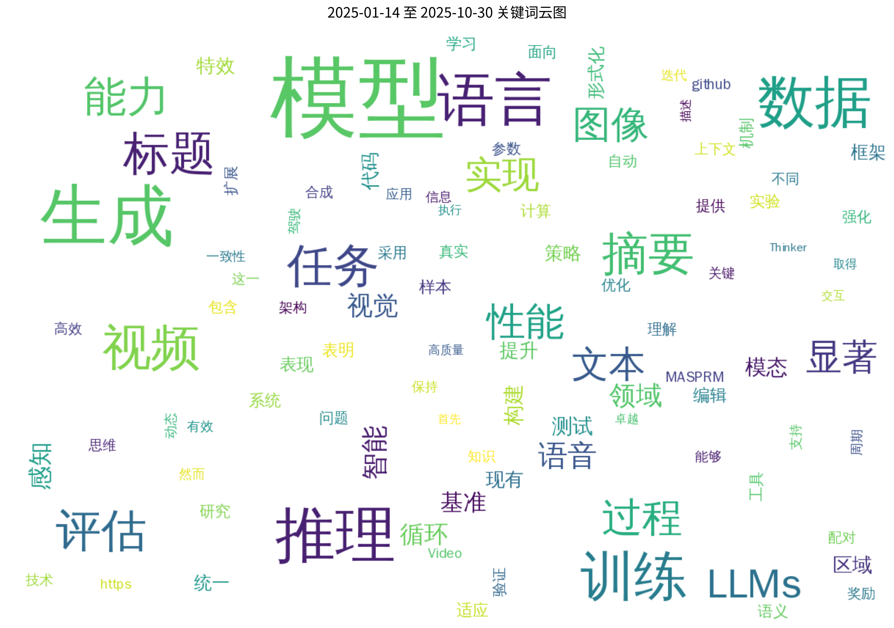
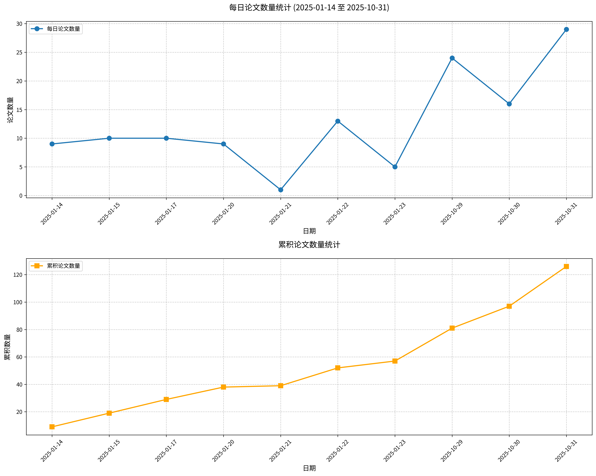

#  Hugging Face 2025-10-30 论文日报

## 📊 今日论文统计
- 总论文数：16
- 热门领域：GPT, LLM, Transformer

## 📝 论文详情

### 1. Video-Thinker：通过强化学习实现“视频思维”的突破

**原文标题：** Video-Thinker: Sparking "Thinking with Videos" via Reinforcement
  Learning

**摘要：**
近期图像推理方法（尤其是“图像思维”范式）在多模态大语言模型中取得显著成功，然而这种动态推理范式尚未扩展至视频推理任务。本文提出Video-Thinker框架，通过自主利用模型固有的“定位”与“描述”能力，在推理过程中持续生成思维线索，使多模态大语言模型具备视频思维能力。为激发此能力，我们构建了Video-Thinker-10K数据集，该精选数据集包含思维链推理序列中的自主工具使用记录。我们的训练策略首先通过监督微调学习推理格式，随后采用分组相对策略优化强化推理能力。该方法使多模态大语言模型能自主执行视频推理中的定位与描述任务，无需构建和调用外部工具。大量实验表明，Video-Thinker在领域内任务及具有挑战性的领域外视频推理基准（包括Video-Holmes、CG-Bench-Reasoning和VRBench）上均实现显著性能提升。我们的Video-Thinker-7B模型显著超越Video-R1等现有基线，在70亿参数规模的多模态大语言模型中确立了最先进的性能水平。

**论文链接：** [HuggingFace](https://huggingface.co/papers/2510.23473) | [arXiv](https://arxiv.org/abs/2510.23473)

---

### 2. JanusCoder：构建面向代码智能的基础视觉-编程交互框架

**原文标题：** JanusCoder: Towards a Foundational Visual-Programmatic Interface for
  Code Intelligence

**摘要：**
神经代码智能的研究范畴正迅速突破基于文本的源代码范畴，逐步涵盖程序生成的丰富视觉输出。这一视觉维度对于灵活内容生成和精准的程序驱动可视化编辑等高级应用至关重要。然而，高质量多模态代码数据的稀缺阻碍了研究进展，这一瓶颈源于数据合成与质量评估的双重挑战。为应对这些挑战，我们从数据和建模两个维度做出贡献：首先提出完整的合成工具包，通过利用数据模态间的协同效应，高效构建涵盖标准图表、复杂交互式网页界面及代码驱动动画的大规模高质量语料库。基于此工具包，我们构建了迄今规模最大的多模态代码数据集JanusCode-800K。该数据集支撑了我们开发的JanusCoder与JanusCoderV系列模型的训练，建立了支持从文本指令、视觉输入或二者结合生成代码的视觉-编程交互接口。我们的统一模型突破了现有方法为孤立任务构建专用模型的局限。在文本主导和视觉主导的编码任务上的大量实验表明，JanusCoder系列性能卓越，其70亿至140亿参数规模的模型在多项指标上接近甚至超越商业模型性能。此外，深入分析为协调程序逻辑与其视觉表达提供了关键见解。我们的代码与模型参数已开源：https://github.com/InternLM/JanusCoder。

**论文链接：** [HuggingFace](https://huggingface.co/papers/2510.23538) | [arXiv](https://arxiv.org/abs/2510.23538)

---

### 3. RegionE：面向高效图像编辑的自适应区域感知生成框架

**原文标题：** RegionE: Adaptive Region-Aware Generation for Efficient Image Editing

**摘要：**
基于指令的图像编辑技术近年来受到广泛关注。在实际应用中，该技术通常仅需修改图像的特定区域，而其他区域基本保持不变。尽管这两类区域在生成难度和计算冗余度上存在显著差异，现有图像编辑模型却未考虑这种区别，而是对整个图像采用统一的生成流程。为此，我们提出RegionE——一种无需额外训练的自适应区域感知生成框架，可有效加速图像编辑任务。该框架包含三个核心组件：1）自适应区域划分。通过观察发现未编辑区域的生成轨迹呈直线特征，使得多步去噪预测可简化为单步推理。因此在去噪初期，我们根据最终预估结果与参考图像的差异将图像划分为编辑区域与未编辑区域；2）区域感知生成。完成区域划分后，对未编辑区域采用单步预测替代多步去噪；对于轨迹呈弯曲特征的编辑区域，则实施局部迭代去噪。为提升局部迭代生成的效率与质量，我们提出区域指令键值缓存技术，在降低计算成本的同时融合全局信息；3）自适应速度衰减缓存。通过观测发现编辑区域相邻时间步的速度向量具有强相关性，我们进一步提出自适应速度衰减缓存机制以加速局部去噪过程。将RegionE应用于当前最先进的图像编辑基础模型（包括Step1X-Edit、FLUX.1 Kontext和Qwen-Image-Edit）后，分别实现了2.57倍、2.41倍和2.06倍的加速效果。经GPT-4o评估验证，该方法在保持语义一致性和视觉保真度方面均有优异表现。

**论文链接：** [HuggingFace](https://huggingface.co/papers/2510.25590) | [arXiv](https://arxiv.org/abs/2510.25590)

---

### 4. 通过循环语言模型实现潜在推理的规模化

**原文标题：** Scaling Latent Reasoning via Looped Language Models

**摘要：**
现代大语言模型主要通过显式文本生成（如思维链）进行"思考"训练，这种方式将推理推迟到训练后阶段，未能充分利用预训练数据。我们提出并开源了以递归衔尾蛇命名的Ouro模型系列——一种预训练的循环语言模型，通过以下方式将推理构建融入预训练阶段：（i）潜在空间中的迭代计算，（ii）基于熵正则化的深度分配目标函数，（iii）扩展至7.7万亿训练标记。Ouro 1.4B和2.6B模型在广泛基准测试中表现出卓越性能，可媲美最高120亿参数的现有最优大语言模型。通过受控实验，我们证明该优势并非源于知识容量的提升，而是来自更卓越的知识操纵能力。我们还发现相较于显式思维链，循环语言模型生成的推理轨迹与最终输出具有更高一致性。我们的研究成果展现了循环语言模型作为推理时代新型扩展方向的潜力。模型获取地址：http://ouro-llm.github.io。

**论文链接：** [HuggingFace](https://huggingface.co/papers/2510.25741) | [arXiv](https://arxiv.org/abs/2510.25741)

---

### 5. 工具十项全能：面向多样化、真实化及长周期任务执行的语言智能体基准测试

**原文标题：** The Tool Decathlon: Benchmarking Language Agents for Diverse, Realistic,
  and Long-Horizon Task Execution

**摘要：**
现实世界中的语言智能体必须能够处理跨多样化应用程序的复杂多步骤工作流。例如，智能体可能需要通过协调日历和文件系统来管理电子邮件，或根据操作手册监控生产数据库以检测异常并生成报告。然而，现有语言智能体基准测试往往局限于狭窄领域或简化任务，缺乏评估智能体真实性能所需的多样性、真实性和长周期复杂性。为弥补这一空白，我们推出工具十项全能（Toolathlon）基准测试，该测试通过提供多样化应用程序与工具、真实环境设置及可靠的执行效果评估，专门用于语言智能体能力测评。Toolathlon涵盖32个软件应用程序和604种工具，范围从日常平台（如Google日历和Notion）到专业系统（如WooCommerce、Kubernetes和BigQuery）。大部分工具基于我们修订或自主实现的高质量模型上下文协议（MCP）服务器构建。与既往主要确保功能真实性但环境状态多样性有限的研究不同，我们提供了来自真实软件的初始环境状态，例如包含数十名学生的Canvas课程系统或真实的财务报表。本基准测试共包含108项人工采集或精心设计的任务，平均需要跨20个交互轮次与多个应用程序进行交互才能完成。每项任务均通过专用评估脚本进行严格验证。对前沿模型的综合评估揭示了其显著不足：表现最佳的Claude-4.5-Sonnet模型成功率仅为38.6%，平均工具调用轮次达20.2次；而表现最优的开源模型DeepSeek-V3.2-Exp成功率仅为20.1%。我们期待Toolathlon能推动面向现实世界长周期任务执行的更强语言智能体的发展。

**论文链接：** [HuggingFace](https://huggingface.co/papers/2510.25726) | [arXiv](https://arxiv.org/abs/2510.25726)

---

### 6. 基于过程挖掘的推理感知GRPO方法研究

**原文标题：** Reasoning-Aware GRPO using Process Mining

**摘要：**
基于强化学习的事后训练方法对于实现大型推理模型的多步推理能力至关重要，然而现有的奖励机制通常仅关注最终结果。本研究提出PM4GRPO方法——一种推理感知的群组相对策略优化框架，通过在标准答案/格式奖励基础上引入推理过程的评估信号。该方法创新性地运用过程挖掘技术计算标量一致性奖励，用于量化策略模型与预训练教师模型在推理过程上的吻合程度。在五项基准测试中的实证结果表明，PM4GRPO在基于GRPO的事后训练中显著优于现有方法。这些发现充分证明，利用过程挖掘技术实现推理感知的GRPO能有效增强策略模型的推理能力。

**论文链接：** [HuggingFace](https://huggingface.co/papers/2510.25065) | [arXiv](https://arxiv.org/abs/2510.25065)

---

### 7. VFXMaster：基于上下文学习的动态视觉特效生成框架

**原文标题：** VFXMaster: Unlocking Dynamic Visual Effect Generation via In-Context
  Learning

**摘要：**
视觉特效对数字媒体的表现力具有关键作用，但其创作仍是生成式人工智能面临的重大挑战。现有方法普遍采用"单一特效对应单一LoRA"的范式，这种模式不仅资源消耗大，且本质上无法泛化至未知特效，从而限制了系统的可扩展性与创作能力。为应对这一挑战，我们提出了VFXMaster——首个基于参考视频的统一视觉特效生成框架。该框架将特效生成重构为上下文学习任务，使其能够将参考视频中的多样化动态效果迁移至目标内容。特别值得关注的是，该方法对未见过的特效类别展现出卓越的泛化能力。具体而言，我们设计了上下文条件策略，通过参考样本对模型进行提示；创新性地引入上下文注意力掩码机制，精准解耦并注入核心特效属性，使统一模型在避免信息泄露的前提下掌握特效模仿能力。此外，我们提出高效的单样本特效自适应机制，可基于用户提供的单段视频快速提升对复杂未知特效的泛化能力。大量实验证明，我们的方法能有效模仿多类别特效信息，并对领域外特效表现出优异的泛化性能。为促进后续研究，我们将向社区公开代码、模型及完整数据集。

**论文链接：** [HuggingFace](https://huggingface.co/papers/2510.25772) | [arXiv](https://arxiv.org/abs/2510.25772)

---

### 8. ReForm：基于前瞻有界序列优化的反射式自动形式化方法

**原文标题：** ReForm: Reflective Autoformalization with Prospective Bounded Sequence
  Optimization

**摘要：**
自动形式化旨在将自然语言数学表述转换为机器可验证的形式化陈述，对于运用形式化数学推理解决自然语言数学问题具有关键意义。尽管大语言模型能够生成语法正确的形式化陈述，但往往难以保持原始问题的语义意图。这一局限源于现有方法将自动形式化简单视为翻译任务，缺乏人类专家自然运用的自我反思与迭代优化机制。为解决这些问题，我们提出ReForm——一种反射式自动形式化方法，通过将语义一致性评估深度整合至形式化过程，使模型能够迭代生成形式化陈述、评估语义保真度，并通过渐进优化实现自我纠错。为有效训练该反射模型，我们提出前瞻有界序列优化方法，通过在序列不同位置采用差异化奖励机制，确保模型既实现精确的形式化转换又完成正确的语义验证，避免产生削弱反思效用的表面化评判。在四个自动形式化基准上的大量实验表明，ReForm相较最强基线平均提升17.2个百分点。为进一步确保评估可靠性，我们构建了ConsistencyCheck基准集，包含859项经专家标注的测试项，不仅验证了大语言模型作为评估者的可行性，更揭示出自动形式化本身固有的困难：即使人类专家在高达38.5%的情况下也会产生语义错误。

**论文链接：** [HuggingFace](https://huggingface.co/papers/2510.24592) | [arXiv](https://arxiv.org/abs/2510.24592)

---

### 9. 重新审视驾驶世界模型：作为感知任务的合成数据生成器

**原文标题：** Rethinking Driving World Model as Synthetic Data Generator for
  Perception Tasks

**摘要：**
驾驶世界模型的最新进展实现了高质量RGB视频或多模态视频的可控生成。现有方法主要关注生成质量与可控性相关指标，却往往忽视对下游感知任务的评估——这对自动驾驶性能至关重要。传统方法通常采用先在合成数据上预训练、再在真实数据上微调的训练策略，导致训练周期达到基准方法（仅使用真实数据）的两倍。当我们将基准方法的训练周期加倍时，合成数据的优势变得微乎其微。为充分验证合成数据的价值，我们提出Dream4Drive——一个专为增强下游感知任务设计的新型合成数据生成框架。该框架首先将输入视频分解为若干三维感知引导图，随后将三维资源渲染至这些引导图，最后通过微调驾驶世界模型生成经过编辑的多视角逼真视频，用于训练下游感知模型。Dream4Drive实现了大规模生成多视角边缘案例的前所未有的灵活性，显著提升自动驾驶中的边缘案例感知能力。为促进后续研究，我们还构建了名为DriveObj3D的大规模三维资源数据集，涵盖驾驶场景中的典型类别，支持多样化的三维感知视频编辑。综合实验表明，在不同训练周期下，Dream4Drive能有效提升下游感知模型的性能。

**论文链接：** [HuggingFace](https://huggingface.co/papers/2510.19195) | [arXiv](https://arxiv.org/abs/2510.19195)

---

### 10. 高效测试时计算扩展的并行循环Transformer

**原文标题：** Parallel Loop Transformer for Efficient Test-Time Computation Scaling

**摘要：**
大型语言模型虽然功能强大，但在实际推理应用中往往存在速度缓慢和计算成本高昂的问题。循环Transformer通过在多轮计算步骤（即“循环”）中复用相同权重来实现参数节约，但该方法存在显著缺陷：循环必须顺序执行，导致推理延迟和内存需求随循环次数增加而线性增长，因而难以适用于实时场景。为解决这一问题，我们提出并行循环Transformer（PLT）。这种新型架构既能保持深层循环模型的性能优势，又具备标准非循环模型的低延迟特性。PLT通过两项核心技术实现突破：首先，跨循环并行技术（CLP）通过单次前向传播同时处理不同词元的独立计算循环，打破了顺序依赖；其次，为抑制内存开销增长，采用高效表征增强策略——将首轮循环的键值缓存共享至所有后续循环，并引入门控滑动窗口注意力机制（G-SWA）将全局共享信息与局部特征动态融合，从而保持高精度。实验表明，PLT在达到传统循环模型精度的同时，其延迟与内存开销相较于标准Transformer几乎未见增长。

**论文链接：** [HuggingFace](https://huggingface.co/papers/2510.24824) | [arXiv](https://arxiv.org/abs/2510.24824)

---

### 11. MASPRM：多智能体系统过程奖励模型

**原文标题：** MASPRM: Multi-Agent System Process Reward Model

**摘要：**
多智能体系统（MAS）的实际部署需要强大的测试时性能，这推动了引导推理时搜索并选择性分配计算资源以提升质量的方法发展。我们提出多智能体系统过程奖励模型（MASPRM），该模型通过为智能体间交互片段中的每个动作和每个智能体分配价值，充当推理时控制器。MASPRM基于多智能体蒙特卡洛树搜索（MCTS） rollout进行训练，通过将回报传播至局部目标，无需步骤级人工标注。在推理阶段，MASPRM指导步骤级束搜索和MCTS，将计算资源聚焦于潜力分支并实现早期剪枝。在GSM8K和MATH数据集上，结合最终答案结果奖励模型（ORM）的MASPRM引导解码，相较于单次直通式MAS处理，其精确匹配率（EM）分别提升30.7和22.9个百分点。在GSM8K上训练的MASPRM模型无需重新训练即可零样本迁移至MATH数据集，在相同计算预算下实现8.4个EM点的提升。MASPRM作为插件式价值模型，能够评估单智能体进度并补充验证器式解码器，从而实现更可靠、具备计算感知能力的多智能体推理。代码地址：https://github.com/milad1378yz/MASPRM

**论文链接：** [HuggingFace](https://huggingface.co/papers/2510.24803) | [arXiv](https://arxiv.org/abs/2510.24803)

---

### 12. 明闪万象：面向多模态感知与生成的稀疏统一架构

**原文标题：** Ming-Flash-Omni: A Sparse, Unified Architecture for Multimodal
  Perception and Generation

**摘要：**
本文提出明闪万象——明万象的升级版本，其基于灵闪2.0的稀疏专家混合架构，总参数量达千亿级别，但每个令牌仅激活61亿参数。该架构实现了高效扩展（在显著提升计算效率的同时大幅扩展模型容量），并强化了视觉、语音与文本领域的统一多模态智能，标志着向通用人工智能迈进的关键一步。相较于前代模型，升级版本在多模态理解与生成任务上均取得显著提升：在语音识别领域实现突破性进展，上下文语音识别达到业界最优水平，方言感知语音识别获得极具竞争力的结果；在图像生成领域引入高保真文本渲染技术，在图像编辑的场景连贯性与身份保持方面表现突出；创新性提出生成式分割能力，不仅具备独立分割优势，更增强了图像生成的空间控制力与编辑一致性。值得关注的是，明闪万象在文图生成与生成式分割任务中达到业界最佳水平，并在全部12项上下文语音识别基准测试中刷新记录，所有功能均集成于单一统一架构之中。

**论文链接：** [HuggingFace](https://huggingface.co/papers/2510.24821) | [arXiv](https://arxiv.org/abs/2510.24821)

---

### 13. SeeingEye：基于智能体信息流的纯文本大语言模型多模态推理能力解锁

**原文标题：** SeeingEye: Agentic Information Flow Unlocks Multimodal Reasoning In
  Text-only LLMs

**摘要：**
当前纯文本大语言模型（如DeepSeek-R1）在推理能力方面取得显著进展，但在处理多模态任务时仍存在能力局限。现有方法主要依赖单一形式的图像描述，这种描述缺乏多样性且难以适配不同类型的视觉问答基准测试，导致无法建立有效传递细粒度视觉信息的机制。本文提出SeeingEye模块化框架，通过基于智能体的小型视觉语言模型翻译器，解锁纯文本大语言模型的多模态推理能力。该翻译器作为感知智能体，可调用专用工具（如OCR和图像裁剪），将多模态输入迭代提炼为面向问题的结构化中间表示。这些结构化表示随后传递给作为推理智能体的纯文本大语言模型。关键创新在于翻译器与推理器之间通过多轮反馈交互，实现针对性视觉细节提取并生成更高置信度的答案。在知识密集型视觉问答基准测试（包括MMMU和MIA-Bench）上的实验表明，SeeingEye不仅降低了推理成本，更超越了规模更大的端到端视觉语言模型。例如，结合30亿参数视觉翻译器与80亿参数语言推理器的实例，在基于知识的挑战性问题上的表现优于单体320亿参数视觉语言模型。研究结果证明，通过智能体信息流实现感知与推理的解耦，为多模态推理提供了可扩展的即插即用路径，使强文本大语言模型能充分发挥其推理潜力。项目代码详见：https://github.com/ulab-uiuc/SeeingEye

**论文链接：** [HuggingFace](https://huggingface.co/papers/2510.25092) | [arXiv](https://arxiv.org/abs/2510.25092)

---

### 14. TheraMind：面向纵向心理咨询的策略性自适应智能体

**原文标题：** TheraMind: A Strategic and Adaptive Agent for Longitudinal Psychological
  Counseling

**摘要：**
基于大语言模型的心理咨询应用日益受到关注。然而现有方法普遍存在情感理解不足、策略适应性欠缺以及跨会话治疗技术运用不充分等问题，尤其缺乏长期记忆机制支撑的多轮对话能力，导致与真实临床实践存在显著差距。为突破这些关键瓶颈，我们提出TheraMind——一种面向纵向心理咨询的策略性自适应智能体。该系统的核心创新在于新颖的双循环架构：将会话内循环用于战术级对话管理，跨会话循环负责战略级治疗规划。会话内循环通过感知患者情绪状态动态选择应答策略，并借助跨会话记忆确保连续性；跨会话循环则通过评估每次会谈的治疗效果，动态调整后续干预方法，实现长期适应性。我们在基于真实临床案例构建的高保真模拟环境中验证该方法。综合评估表明，TheraMind在连贯性、灵活性和治疗协调性等多会话指标上显著优于现有方法，验证了双循环设计在模拟战略性、自适应及纵向治疗行为方面的有效性。代码已开源：https://0mwwm0.github.io/TheraMind/。

**论文链接：** [HuggingFace](https://huggingface.co/papers/2510.25758) | [arXiv](https://arxiv.org/abs/2510.25758)

---

### 15. PairUni：面向统一多模态语言模型的配对式训练方法

**原文标题：** PairUni: Pairwise Training for Unified Multimodal Language Models

**摘要：**
统一视觉语言模型需要在单一架构中同时完成理解与生成任务，但这两类任务依赖异构数据与监督信号，导致在强化学习过程中难以实现有效平衡。本文提出PairUni统一框架，通过将数据重组为理解-生成配对样本并实施对齐优化策略。我们首先采用GPT-4技术增强单任务数据：为理解样本生成描述文本，为生成样本构建问答对，从而形成同源实例的精准对齐配对。此外，针对每个生成样本，我们检索语义相关的理解样本构建检索式配对，建立异源数据点的语义关联。这种配对结构显式呈现跨任务语义对应关系，支撑一致性策略学习。基于该结构，我们提出Pair-GPRO——基于群组相对策略优化的配对感知变体，通过为每对样本分配相似度评分来调节优势函数，强化对齐良好样本的学习效果并降低任务间干扰。我们精心构建包含1.6万组理解-生成配对的高质量数据集PairUG用于强化学习微调，并在高性能Janus-Pro统一视觉语言模型上评估PairUni。实验表明该方法在多种统一视觉语言模型中实现均衡性能提升，显著优于现有强化学习基线模型。代码地址：https://github.com/Haochen-Wang409/PairUni

**论文链接：** [HuggingFace](https://huggingface.co/papers/2510.25682) | [arXiv](https://arxiv.org/abs/2510.25682)

---

### 16. BhashaBench V1：印度知识象限领域的综合性基准测试框架

**原文标题：** BhashaBench V1: A Comprehensive Benchmark for the Quadrant of Indic
  Domains

**摘要：**
大语言模型的快速发展加剧了对领域与文化特异性评估的需求。现有基准测试主要围绕英语语境且缺乏领域针对性，限制了其在印度中心场景下的适用性。为弥补这一空白，我们推出BhashaBench V1——首个专注于印度核心知识体系的领域特异性、多任务、双语基准测试。该基准包含74,166个精心构建的问答对（其中英文52,494组，印地语21,672组），数据源自真实的政府及专业领域考试，涵盖农业、法律、金融与阿育吠陀四大核心领域，包含90余个子领域及500多个专题，支持细粒度评估。对29款大语言模型的评估结果显示：模型在不同领域和语言间存在显著性能差异，尤其在低资源领域表现悬殊。例如GPT-4o在法律领域总体准确率达76.49%，而在阿育吠陀领域仅为59.74%；所有领域内模型对英文内容的处理能力均稳定优于印地语。子领域分析表明，网络法、国际金融等领域表现相对较好，而潘查卡尔玛疗法、种子科学、人权等领域仍明显薄弱。BhashaBench V1为评估大语言模型在印度多元知识领域的表现提供了完整数据集，可检验模型融合领域专业知识与双语理解的能力。所有代码、基准数据及相关资源均已公开，以支持开放式研究。

**论文链接：** [HuggingFace](https://huggingface.co/papers/2510.25409) | [arXiv](https://arxiv.org/abs/2510.25409)

---

## 🔍 关键词云图

## 📈 近期论文趋势

## 🎙️ 语音播报
- [收听今日论文解读](../audio/2025-10-30_daily_papers.mp3)

## 📱 订阅渠道
- GitHub: [hf-daily-paper-newsletter-chinese](https://github.com/2404589803/hf-daily-paper-newsletter-chinese)