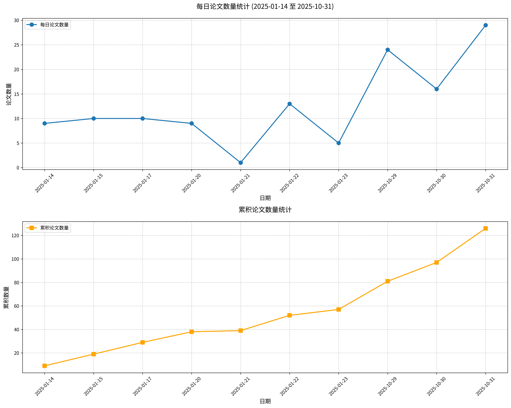

#  Hugging Face 2025-10-31 论文日报

## 📊 今日论文统计
- 总论文数：29
- 热门领域：Transformer, Vision, RL, GPT, LLM

## 📝 论文详情

### 1. 手动解码的终结：迈向真正端到端的语言模型

**原文标题：** The End of Manual Decoding: Towards Truly End-to-End Language Models

**摘要：**
当前大型语言模型的"端到端"属性实为误称。实践中它们仍依赖于不可微分的解码过程，需要人工繁琐调整温度系数和top-p等超参数。本文提出AutoDeco创新架构，通过让模型学习自主控制解码策略，实现真正的"端到端"生成。我们在标准Transformer基础上增设轻量级输出头，使其能在每个生成步骤动态预测上下文相关的温度值与top-p参数，同时输出下一个词元的逻辑值。这种方法将解码过程转化为参数化的词元级操作，使模型在单次前向传播中即可实现自适应的采样策略调控。

**论文链接：** [HuggingFace](https://huggingface.co/papers/2510.26697) | [arXiv](https://arxiv.org/abs/2510.26697)

---

### 2. Emu3.5：原生多模态模型的世界认知能力

**原文标题：** Emu3.5: Native Multimodal Models are World Learners

**摘要：**
本文提出Emu3.5——一种通过原生方式预测视觉与语言跨模态状态演进的大规模多模态世界模型。该模型基于包含超10万亿标记的视觉语言交织数据集进行端到端预训练，训练数据主要源自互联网视频的连续帧序列及对应文本转录，采用统一的下一标记预测目标。该模型天然支持视觉语言交织输入，并生成相应的多模态交织输出。通过大规模强化学习后训练，Emu3.5进一步增强了多模态推理与生成能力。为提升推理效率，我们提出离散扩散适配（DiDA）方法，将逐标记解码转换为双向并行预测，在保持性能不变的前提下实现单图像推理约20倍加速。实验表明，Emu3.5具备强大的原生多模态能力，包括长程视觉语言生成、任意模态到图像（X2I）生成及复杂文本图像生成，同时展现出可泛化的世界建模能力，能够实现时空一致的世界探索及开放世界具身操作。在图像生成与编辑任务中，Emu3.5达到与Gemini 2.5 Flash Image（Nano Banana）相当的性能，并在交织生成任务集上表现优异。我们已开源Emu3.5模型（https://github.com/baaivision/Emu3.5）以支持社区研究。

**论文链接：** [HuggingFace](https://huggingface.co/papers/2510.26583) | [arXiv](https://arxiv.org/abs/2510.26583)

---

### 3. Kimi Linear：一种高表现力、高效率的注意力架构

**原文标题：** Kimi Linear: An Expressive, Efficient Attention Architecture

**摘要：**
本文提出Kimi Linear混合线性注意力架构，该架构在多种场景（包括短上下文、长上下文及强化学习扩展机制）的公平比较中，首次实现了对全注意力机制的全面超越。其核心组件Kimi Delta注意力（KDA）是一种高表现力的线性注意力模块，通过细粒度门控机制扩展了门控DeltaNet，能更有效地利用有限有限状态RNN记忆。我们设计的定制化分块算法采用对角加低秩（DPLR）转移矩阵的特化变体，在保持与经典Delta规则更高一致性的同时，较通用DPLR公式显著降低计算量，实现了优异的硬件效率。

**论文链接：** [HuggingFace](https://huggingface.co/papers/2510.26692) | [arXiv](https://arxiv.org/abs/2510.26692)

---

### 4. 智能体能否征服网络？探索ChatGPT Atlas智能体在网络游戏中的前沿表现

**原文标题：** Can Agent Conquer Web? Exploring the Frontiers of ChatGPT Atlas Agent in
  Web Games

**摘要：**
OpenAI的ChatGPT Atlas模型引入了全新的网络交互能力，使模型能够分析网页内容、处理用户意图，并直接在浏览器中执行光标与键盘输入操作。尽管该模型在信息检索任务中已展现出色能力，但其在动态交互环境中的表现仍待深入探索。本研究基于浏览器游戏（包括谷歌恐龙跑酷、数独游戏、Flappy Bird及Stein.world）作为测试场景，对Atlas的网络交互能力进行早期评估。我们采用游戏内评分作为量化指标，以衡量其在不同任务类型中的表现。研究结果表明，Atlas在数独等逻辑推理任务中表现优异，解题速度显著超越人类基准，但在需要精确时序和动作控制的实时游戏中表现欠佳，往往难以突破初始障碍。这些发现表明，虽然Atlas展现出强大的分析处理能力，但在需要实时交互的动态网络环境中仍存在明显局限。本项目网站地址：https://atlas-game-eval.github.io。

**论文链接：** [HuggingFace](https://huggingface.co/papers/2510.26298) | [arXiv](https://arxiv.org/abs/2510.26298)

---

### 5. 探索扩散模型在机器人控制中的适用条件

**原文标题：** Exploring Conditions for Diffusion models in Robotic Control

**摘要：**
尽管预训练视觉表征已显著推动模仿学习的发展，但这些表征通常在策略学习过程中保持固定，导致其与具体任务解耦。本研究探索如何利用预训练文生图扩散模型获取适用于机器人控制的任务自适应视觉表征，且无需对模型本身进行微调。然而我们发现，直接套用文本条件——这一在其他视觉领域取得成功的策略——在控制任务中收效甚微甚至产生负面效果。我们将此归因于扩散模型训练数据与机器人控制环境之间的领域差异，进而提出应构建考虑控制任务所需特定动态视觉信息的条件机制。为此，我们提出ORCA框架，通过引入可适应控制环境的学习式任务提示词，以及捕捉细粒度帧级特征的视觉提示词，构建新型条件机制促进任务自适应表征的学习。实验表明，基于新设计条件机制的任务自适应表征方法在多项机器人控制基准测试中达到最优性能，显著超越现有方法。

**论文链接：** [HuggingFace](https://huggingface.co/papers/2510.15510) | [arXiv](https://arxiv.org/abs/2510.15510)

---

### 6. AMO-Bench：大语言模型在高中数学竞赛中仍面临挑战

**原文标题：** AMO-Bench: Large Language Models Still Struggle in High School Math
  Competitions

**摘要：**
我们提出AMO-Bench——一个具有奥林匹克竞赛级别或更高难度的进阶数学推理基准，包含50道人工设计的题目。现有基准普遍采用高中数学竞赛来评估大语言模型（LLM）的数学推理能力，但由于性能饱和现象（如AIME24/25），许多现有数学竞赛对顶尖LLM的评估效能正在减弱。为此，AMO-Bench通过确保所有50道题目满足以下条件来引入更严格的挑战：（1）经专家交叉验证达到国际数学奥林匹克（IMO）难度标准；（2）全部为原创题目以避免数据记忆导致的性能泄露。此外，AMO-Bench中每道题仅需最终答案而非证明过程，支持自动可靠的评估分级。在26个LLM上的实验结果表明，即使最佳模型在AMO-Bench上也仅达到52.4%的准确率，多数模型得分低于40%。除表现不佳外，我们进一步分析发现增加测试时计算量在AMO-Bench上呈现出积极的规模扩展趋势。这些结果凸显出现有LLM在数学推理能力方面仍有巨大提升空间。我们公开发布AMO-Bench以推动语言模型推理能力进阶研究。

**论文链接：** [HuggingFace](https://huggingface.co/papers/2510.26768) | [arXiv](https://arxiv.org/abs/2510.26768)

---

### 7. Surfer 2：新一代跨平台计算机智能体系统

**原文标题：** Surfer 2: The Next Generation of Cross-Platform Computer Use Agents

**摘要：**
构建能够泛化应用于网页、桌面及移动环境的智能体仍面临重大挑战，现有系统多依赖特定环境接口，限制了跨平台部署能力。本文提出Surfer 2统一架构，该系统仅通过视觉观察实现操作，在三大环境中均达到最先进性能。Surfer 2融合了分层上下文管理、解耦规划与执行机制，以及具备自适应恢复能力的自我验证模块，确保在长周期任务中实现可靠运行。本系统在WebVoyager达到97.1%准确率，WebArena达69.6%，OSWorld达60.1%，AndroidWorld达87.1%，无需任务特定微调即超越所有现有系统。通过多轮尝试，Surfer 2在所有基准测试中均超越人类表现。这些结果表明：系统化架构设计能显著增强基础模型能力，仅通过视觉交互即可实现通用计算机控制，同时亟需开发新一代视觉语言模型以实现帕累托最优的成本效益。

**论文链接：** [HuggingFace](https://huggingface.co/papers/2510.19949) | [arXiv](https://arxiv.org/abs/2510.19949)

---

### 8. 视频模型是否已具备零样本推理能力？基于MME-CoF基准的实证研究

**原文标题：** Are Video Models Ready as Zero-Shot Reasoners? An Empirical Study with
  the MME-CoF Benchmark

**摘要：**
当前视频生成模型能够制作高保真度、时序连贯的视频内容，表明其可能编码了丰富的世界知识。除逼真合成能力外，这些模型还展现出表征视觉感知、建模与操作的新兴能力。然而一个重要问题尚未解决：在具有挑战性的视觉推理场景中，视频模型是否已具备作为零样本推理器的条件？本研究通过实证分析系统探讨该问题，聚焦于主流模型Veo-3。我们从12个维度评估其推理行为，涵盖空间、几何、物理、时序及具身逻辑等领域，系统刻画其优势与失效模式。为规范研究过程，我们构建了MME-CoF评估基准——一个支持对帧间推理链进行深入全面评估的紧凑型基准。研究发现：当前视频模型在短时域空间连贯性、细粒度语义 grounding 及局部一致性动态方面展现出有前景的推理模式，但在长时域因果推理、严格几何约束及抽象逻辑方面仍存在局限。总体而言，视频模型尚未成为可靠的独立零样本推理器，但作为专用推理模型的互补视觉引擎展现出令人鼓舞的潜力。项目主页：https://video-cof.github.io

**论文链接：** [HuggingFace](https://huggingface.co/papers/2510.26802) | [arXiv](https://arxiv.org/abs/2510.26802)

---

### 9. 可泛化运动生成的探索：数据、模型与评估框架

**原文标题：** The Quest for Generalizable Motion Generation: Data, Model, and
  Evaluation

**摘要：**
尽管三维人体运动生成技术在标准基准测试中取得显著进展，现有模型在泛化能力方面仍面临根本性瓶颈。相比之下，相邻生成领域（尤以视频生成最为突出）在人类行为建模中展现出卓越的泛化性能，这为运动生成领域提供了可迁移的重要启示。基于此发现，我们提出一个贯穿数据、建模与评估三大支柱的完整框架，系统化地实现从视频生成到运动生成的知识迁移。首先，我们构建ViMoGen-228K大规模数据集，包含22.8万组高质量运动样本，通过融合高精度光学动捕数据、网络视频语义标注动作以及顶尖视频生成模型合成的样本，同时包含文本-运动对与文本-视频-运动三元组，显著扩展了语义多样性。其次，我们提出基于流匹配的扩散变换器ViMoGen，通过门控多模态条件机制统一动捕数据与视频生成模型先验。为提升效率，我们进一步开发蒸馏变体ViMoGen-light，在保持强泛化能力的同时消除视频生成依赖。最后，我们推出MBench分层评估基准，支持运动质量、提示符保真度与泛化能力的细粒度评估。大量实验表明，我们的框架在自动评估与人工评估中均显著超越现有方法。相关代码、数据与评估基准将全面公开。

**论文链接：** [HuggingFace](https://huggingface.co/papers/2510.26794) | [arXiv](https://arxiv.org/abs/2510.26794)

---

### 10. 监督式强化学习：从专家轨迹到分步推理

**原文标题：** Supervised Reinforcement Learning: From Expert Trajectories to Step-wise
  Reasoning

**摘要：**
大型语言模型在处理需要多步推理的问题时常面临困难。对于小规模开源模型，基于可验证奖励的强化学习方法在多次尝试后仍难以采样到正确解，而监督微调方法则容易通过逐词僵化模仿对长演示序列产生过拟合。为解决这一局限，我们提出监督式强化学习框架，将问题求解重新定义为生成逻辑"动作"序列的过程。该框架训练模型在执行每个动作前首先生成内部推理独白，并以分步方式根据模型动作与从监督微调数据集中提取的专家动作之间的相似性提供平滑奖励。这种监督机制即使在全轮次错误的情况下也能提供更丰富的学习信号，同时鼓励在专家演示引导下进行灵活推理。实验表明，该框架能使小规模模型学会监督微调或基于可验证奖励的强化学习无法掌握的复杂问题。此外，在采用基于可验证奖励的强化学习进行精调前，先使用监督式强化学习进行初始化训练可获得最佳整体性能。除推理基准测试外，该方法在自主软件工程任务中也展现出良好泛化能力，确立了其作为面向推理的大型语言模型的稳健且通用的训练框架地位。

**论文链接：** [HuggingFace](https://huggingface.co/papers/2510.25992) | [arXiv](https://arxiv.org/abs/2510.25992)

---

### 11. 主体性组织时代：运用语言模型实现协同组织学习

**原文标题：** The Era of Agentic Organization: Learning to Organize with Language
  Models

**摘要：**
我们展望人工智能的新纪元——主体性组织时代，在这一时代中智能体通过协同并行的方式解决复杂问题，实现超越个体智能的成果。为实现这一愿景，我们引入异步思维作为大语言模型推理的新范式，将内部思考过程组织为可并行执行的结构。具体而言，我们提出一种思维协议：组织者动态分配子查询给工作节点，整合中间知识，最终生成连贯解决方案。更重要的是，该协议中的思维结构可通过强化学习进一步优化。实验表明，相较于并行思维模式，异步思维在数学推理任务中推理延迟降低28%的同时提升了准确率。此外，异步思维能够泛化其习得的异步思考能力，无需额外训练即可有效应对未知任务。

**论文链接：** [HuggingFace](https://huggingface.co/papers/2510.26658) | [arXiv](https://arxiv.org/abs/2510.26658)

---

### 12. OmniX：从统一全景生成与感知到图形就绪三维场景

**原文标题：** OmniX: From Unified Panoramic Generation and Perception to
  Graphics-Ready 3D Scenes

**摘要：**
当前构建三维场景主要存在两种主流方式：程序化生成与二维提升技术。其中基于全景的二维提升技术展现出巨大潜力，通过利用强大的二维生成先验知识，能够创造沉浸感强、真实性高且多样化的三维环境。本研究推进该技术以生成适用于基于物理渲染（PBR）、重光照与仿真的图形就绪三维场景。我们的核心突破在于重新定位二维生成模型，使其具备对几何结构、纹理及PBR材质的全景感知能力。与现有侧重外观生成而忽略内在属性感知的二维提升方法不同，我们提出OmniX——一个通用统一框架。该框架基于轻量化高效的多模态适配器结构，将二维生成先验知识复用于全景视觉任务的全领域，包括全景感知、生成与补全。此外，我们构建了大规模合成全景数据集，涵盖来自多样化室内外场景的高质量多模态全景数据。大量实验证明，我们的模型在全景视觉感知和图形就绪三维场景生成方面成效显著，为沉浸式物理真实虚拟世界生成开辟了新路径。

**论文链接：** [HuggingFace](https://huggingface.co/papers/2510.26800) | [arXiv](https://arxiv.org/abs/2510.26800)

---

### 13. MIRO：多奖励条件预训练提升文本到图像生成质量与效率

**原文标题：** MIRO: MultI-Reward cOnditioned pretraining improves T2I quality and
  efficiency

**摘要：**
当前文本到图像生成模型通常在未经筛选的大规模数据集上进行训练，以实现多样化的生成能力。然而，这种训练方式与用户偏好之间存在显著偏差。近期研究专门设计了奖励模型，通过后验选择生成图像使其符合特定奖励（通常指用户偏好）。这种丢弃有效数据并仅针对单一奖励进行优化的方式，往往会损害生成结果的多样性、语义保真度及训练效率。为替代此类后处理方案，我们提出在训练过程中引入多奖励模型条件约束，使模型能够直接学习用户偏好。研究表明，该方法不仅能显著提升生成图像的视觉质量，还可大幅加速训练过程。我们提出的MIRO方法在GenEval组合基准测试及用户偏好评分（PickAScore、ImageReward、HPSv2）中均达到了最先进的性能水平。

**论文链接：** [HuggingFace](https://huggingface.co/papers/2510.25897) | [arXiv](https://arxiv.org/abs/2510.25897)

---

### 14. EHR-R1：面向电子健康记录分析的推理增强型基础语言模型

**原文标题：** EHR-R1: A Reasoning-Enhanced Foundational Language Model for Electronic
  Health Record Analysis

**摘要：**
电子健康记录包含丰富而复杂的信息，其自动化分析对临床决策至关重要。尽管大语言模型在临床工作流程中取得进展，但由于任务覆盖范围有限且缺乏面向电子健康记录的推理能力，其分析电子健康记录的效能仍受制约。本文致力于填补这一空白，具体提出EHR-Ins——一个大规模、综合性的电子健康记录推理指令数据集，涵盖42项不同电子健康记录任务中的30万条高质量推理案例及400万条非推理案例。其核心创新在于采用思维图谱驱动的框架，实现高质量推理数据的大规模生成。基于此，我们开发了EHR-R1系列模型，这是专为电子健康记录分析打造的推理增强型大语言模型，参数量最高达720亿。通过领域自适应、推理增强和强化学习三阶段训练范式，EHR-R1系统化掌握领域知识及多样化推理能力，实现精准稳健的电子健康记录分析。最后，我们基于MIMIC-IV构建了EHR-Bench新基准，涵盖42项任务，全面评估电子健康记录场景中的推理与预测能力。实验表明，EHR-R1持续超越最先进的商业及开源大语言模型（包括DeepSeek-V3和GPT-4o），在MIMIC-Bench上较GPT-4o提升逾30分，在EHRSHOT基准上零样本AUROC提升10%。EHR-Ins、EHR-R1与EHR-Bench共同为推进更可靠、更具临床相关性的电子健康记录分析奠定了重要基础。

**论文链接：** [HuggingFace](https://huggingface.co/papers/2510.25628) | [arXiv](https://arxiv.org/abs/2510.25628)

---

### 15. OmniLayout：基于大语言模型的从粗到精学习实现通用文档版面生成

**原文标题：** OmniLayout: Enabling Coarse-to-Fine Learning with LLMs for Universal
  Document Layout Generation

**摘要：**
文档智能技术发展迅猛并日益受到关注。然而当前研究大多聚焦于文档版面分析，其生成式对应任务——文档版面生成仍待深入探索。主要障碍在于多样化版面的稀缺性：现有研究主要集中于曼哈顿式结构的学术论文，而报纸、杂志等开放领域文档类型的版面表征严重不足。为弥补这一空白，我们构建了首个百万量级多样化文档版面数据集OmniLayout-1M，涵盖六种常见文档类型，包含从多源采集的当代版面设计。此外，针对现有方法在复杂领域表现不佳且难以连贯排列长序列的问题，我们提出了OmniLayout-LLM模型（参数量5亿），采用设计的两阶段从粗到精学习范式：1）通过粗粒度类别定义从OmniLayout-1M学习通用版面设计原则；2）将知识迁移至具有细粒度标注的特定领域。在M^{6}Doc数据集上的大量实验表明，我们的方法在多个领域均取得优异性能，显著超越现有版面生成专家模型及多个最新通用大语言模型。我们的代码、模型和数据集将公开发布。

**论文链接：** [HuggingFace](https://huggingface.co/papers/2510.26213) | [arXiv](https://arxiv.org/abs/2510.26213)

---

### 16. Magentic Marketplace：一个用于研究智能体市场的开源环境

**原文标题：** Magentic Marketplace: An Open-Source Environment for Studying Agentic
  Markets

**摘要：**
随着大语言模型智能体的发展，它们正越来越多地代表用户介导经济决策，从产品发现到交易执行。这类应用虽然前景广阔，但也引发了关于智能体问责制与用户价值的诸多问题。要解决这些问题，需要理解智能体在真实市场环境中的行为表现。然而现有研究大多在受限场景中评估智能体，例如单任务市场（如谈判场景）或结构化的双智能体交互。现实市场存在本质差异：它要求智能体处理多样化的经济活动，并在由多个行为不透明的智能体组成的动态生态系统中通过开放式对话进行协调。为弥补这一差距，我们研究双向智能体市场——助理智能体代表消费者，服务智能体代表竞争企业。为安全研究这些交互，我们开发了Magentic-Marketplace模拟环境，支持助理与服务智能体的协同运作。该环境使我们能够研究关键市场动态：智能体实现的效用、行为偏差、受操纵脆弱性，以及搜索机制如何影响市场结果。实验表明，前沿模型在理想搜索条件下能接近最优福利，但随着规模扩大性能急剧下降，所有模型都表现出严重的首方案偏好，导致响应速度的重要性达到质量因素的10-30倍。这些发现揭示了不同市场条件下行为的涌现规律，为设计公平高效的智能体市场提供了重要参考。

**论文链接：** [HuggingFace](https://huggingface.co/papers/2510.25779) | [arXiv](https://arxiv.org/abs/2510.25779)

---

### 17. MedVLSynther：基于生成器-验证器大语言模型从医学文献合成高质量视觉问答数据的方法

**原文标题：** MedVLSynther: Synthesizing High-Quality Visual Question Answering from
  Medical Documents with Generator-Verifier LMMs

**摘要：**
大型多模态模型在回答需要结合图像与文本进行联合推理的医学问题时表现出日益增强的能力，然而缺乏大规模、可公开使用的高质量语料库阻碍了通用医学视觉问答系统的训练。本文提出MedVLSynther——一种基于规则指导的生成器-验证器框架，该框架通过关联图表、标题及文内参考文献，直接从开放生物医学文献中合成高质量的多选题视觉问答条目。生成器按照机器可校验的JSON模式生成自包含的题干及并行互斥的选项；多级验证器在接收数据前执行必要检验（自包含性、单一正确答案、临床有效性、图文一致性），进行细粒度正向评分，并对常见错误模式实施惩罚。将该流程应用于PubMed Central数据库后获得MedSynVQA数据集：包含13,087道经过审核的问题，涉及14,803幅图像，覆盖13种影像模态和28个解剖区域。使用可验证奖励通过强化学习训练开放权重的大型多模态模型，在六项医学视觉问答基准测试中准确率均得到提升，平均达到55.85（30亿参数）和58.15（70亿参数），其中VQA-RAD数据集最高达77.57，PathVQA数据集达67.76，性能超越现有强医学大型多模态模型。消融实验验证了生成与验证环节的必要性，证明更多经过验证的数据持续带来增益，针对性污染分析未检测到评估集泄露现象。通过完全基于开放文献和开放权重模型的操作，MedVLSynther为可扩展的医学视觉问答训练数据提供了一条可审计、可复现且保护隐私的技术路径。

**论文链接：** [HuggingFace](https://huggingface.co/papers/2510.25867) | [arXiv](https://arxiv.org/abs/2510.25867)

---

### 18. 远程劳动指数：衡量远程工作中的人工智能自动化水平

**原文标题：** Remote Labor Index: Measuring AI Automation of Remote Work

**摘要：**
人工智能在知识与推理的研究导向基准测试中进展迅速，但这些成果如何转化为经济价值与自动化效能尚不明确。为此我们提出远程劳动指数（RLI）——一个广泛覆盖多领域的基准体系，包含旨在评估实际场景中端到端智能体性能的具有经济价值的真实项目。人工智能体在RLI上的表现接近基准下限，表现最佳的智能体仅实现2.5%的自动化率。这些研究结果有助于将人工智能自动化的讨论建立在实证依据之上，为追踪人工智能影响设立统一基准，使相关方能够主动应对人工智能驱动的劳动力自动化变革。

**论文链接：** [HuggingFace](https://huggingface.co/papers/2510.26787) | [arXiv](https://arxiv.org/abs/2510.26787)

---

### 19. 通过头尾数据重平衡抑制大视觉语言模型自提升中的马太效应

**原文标题：** Counteracting Matthew Effect in Self-Improvement of LVLMs through
  Head-Tail Re-balancing

**摘要：**
自提升已成为增强大视觉语言模型推理能力的主流范式，该过程中模型通过迭代探索并学习成功轨迹来实现进化。然而我们发现这一过程存在关键问题：模型擅长为简单查询（即头部数据）生成高质量轨迹，却难以处理复杂查询（即尾部数据）。这种不平衡优化导致模型倾向于优先发展简单推理技能，同时削弱其处理复杂推理任务的能力。随着迭代次数的增加，这种失衡会愈发显著——我们将此动态现象称为“马太效应”——最终阻碍模型的持续改进并形成性能瓶颈。为应对这一挑战，我们提出分布重塑与轨迹重采样双视角下的四种高效策略，在探索式学习的自提升过程中实现头尾数据重新平衡。基于Qwen2-VL-7B-Instruct和InternVL2.5-4B模型在视觉推理任务上的大量实验表明，我们的方法能持续提升视觉推理能力，相较原始自提升方法平均提升3.86个性能点。

**论文链接：** [HuggingFace](https://huggingface.co/papers/2510.26474) | [arXiv](https://arxiv.org/abs/2510.26474)

---

### 20. CRAG-MM：多模态多轮综合RAG基准测试框架

**原文标题：** CRAG-MM: Multi-modal Multi-turn Comprehensive RAG Benchmark

**摘要：**
以智能眼镜为代表的可穿戴设备正在重塑人机交互模式，使使用者能够实时获取视野实体的相关信息。多模态检索增强生成（MM-RAG）技术在此类场景中发挥着关键支撑作用，但目前该领域仍缺乏系统化的基准测试体系，特别是在可穿戴设备应用场景中。为此，我们推出CRAG-MM——面向多模态多轮对话的综合RAG基准测试框架。该框架包含6,500组涵盖13个领域的（图像、问题、答案）三元组，以及2,000组基于视觉的多轮对话数据，其中特别配置6,200张模拟可穿戴设备采集视角的具身化图像。我们通过精心设计的问题集还原真实场景挑战，包含五类图像质量问题、六种提问类型、差异化的实体热度等级、多变的信息动态特性以及多轮对话深度。框架设置三大任务模块：单源增强、多源增强和多轮对话——每个模块均配备对应的检索知识库，并集成图像知识图谱检索与网页检索双API接口。评估数据显示，现行RAG方案在CRAG-MM单轮与多轮问答中的事实准确率仅分别为32%与43%，而业界前沿解决方案的质量指标相近（32%/45%），表明该领域存在显著提升空间。本基准测试已成为KDD Cup 2025竞赛平台，吸引约1,000支参赛团队提交5,000份方案，优胜方案较基线性能提升28%，彰显其对领域发展的前瞻性推动作用。

**论文链接：** [HuggingFace](https://huggingface.co/papers/2510.26160) | [arXiv](https://arxiv.org/abs/2510.26160)

---

### 21. FullPart：全分辨率生成三维部件

**原文标题：** FullPart: Generating each 3D Part at Full Resolution

**摘要：**
基于部件的三维生成技术具有广泛的应用前景。现有部件生成方法主要存在两类局限：采用隐式向量集表征的方法往往缺乏几何细节表现力；而采用显式体素表征的方法通常共享全局体素网格，导致小型部件分配体素不足、生成质量下降。本文提出FullPart创新框架，融合隐式与显式范式优势。首先通过隐式边界框向量集扩散过程生成布局——该任务适合隐式扩散处理，因为边界框标记本身不包含复杂几何细节。随后在每个部件独立的固定全分辨率体素网格中生成细节特征。相较于共享低分辨率空间的方法，本框架使所有部件（包括小型部件）均能以全分辨率生成，从而精确重构复杂几何结构。针对不同尺寸部件间信息交互的错位问题，我们提出中心点编码策略以保持全局一致性。此外，为解决可靠部件数据稀缺问题，我们构建了迄今最大规模人工标注三维部件数据集PartVerse-XL，包含4万个对象与32万个部件。大量实验证明，FullPart在三维部件生成任务中达到最先进水平。我们将公开全部代码、数据与模型，以促进三维部件生成领域的后续研究。

**论文链接：** [HuggingFace](https://huggingface.co/papers/2510.26140) | [arXiv](https://arxiv.org/abs/2510.26140)

---

### 22. PORTool：基于奖励树结构的工具调用大语言模型训练方法

**原文标题：** PORTool: Tool-Use LLM Training with Rewarded Tree

**摘要：**
当前的工具调用大语言模型（LLMs）主要在静态数据集上进行训练，使其能够与外部工具交互并执行多步骤、工具集成的推理过程，从而生成工具调用轨迹。然而，这些模型仅模仿通用工具调用流程中查询的解决方式，未能充分探索潜在解决方案，在动态演变的工具调用环境中表现出性能局限。本研究提出PORTool——一种基于强化学习（RL）的训练方法，通过激励工具调用大语言模型探索产生正确答案的多样化轨迹。该方法首先为给定查询生成多条执行轨迹，其中部分轨迹共享初始工具调用步骤，从而形成树状结构。随后根据每个步骤生成正确答案的能力及工具调用成功率分配奖励：不同轨迹间的共享步骤获得相同奖励，而同一分支下的不同步骤则获得差异化奖励。最终，这些逐步骤奖励被用于计算分支相对优势值，并与轨迹相对优势值融合，以此训练工具调用大语言模型。实验采用17种工具处理用户查询，涵盖时间敏感型与时间无关型主题。通过消融研究系统验证了逐步骤奖励的必要性及设计鲁棒性。与现有训练方法相比，PORTool在最终准确率和工具调用步骤数量方面均展现出显著提升。

**论文链接：** [HuggingFace](https://huggingface.co/papers/2510.26020) | [arXiv](https://arxiv.org/abs/2510.26020)

---

### 23. EnzyControl：为酶骨架生成添加功能性与底物特异性调控

**原文标题：** EnzyControl: Adding Functional and Substrate-Specific Control for Enzyme
  Backbone Generation

**摘要：**
设计具有底物特异性功能的酶骨架是计算蛋白质工程领域的关键挑战。当前生成模型在蛋白质设计中表现出色，但在结合数据、底物特异性调控及从头生成酶骨架的灵活性方面存在局限。为此，我们首先构建了EnzyBind数据集，该数据集从PDBbind中专门筛选出11,100个经实验验证的酶-底物对。基于此，我们提出EnzyControl方法，实现在酶骨架生成过程中对功能与底物特异性的精准调控。该方法通过从精选酶-底物数据中自动提取MSA注释的催化位点及其对应底物，以此作为条件生成酶骨架。EnzyControl的核心是EnzyAdapter——一个集成于预训练基序支架模型中的轻量级模块化组件，使模型具备底物识别能力。采用两阶段训练范式进一步优化模型生成精确功能性酶结构的能力。实验表明，在EnzyBind和EnzyBench基准测试中，我们的EnzyControl在结构与功能指标上均取得最优性能，其中可设计性提升13%，催化效率较基线模型提高13%。代码已发布于https://github.com/Vecteur-libre/EnzyControl。

**论文链接：** [HuggingFace](https://huggingface.co/papers/2510.25132) | [arXiv](https://arxiv.org/abs/2510.25132)

---

### 24. CLASS-IT：面向BabyLM的对话式与讲座对齐小规模指令调优

**原文标题：** CLASS-IT: Conversational and Lecture-Aligned Small-Scale Instruction
  Tuning for BabyLMs

**摘要：**
本研究探讨小规模语言模型能否从指令调优中获益。我们分别使用1亿和1.4亿参数的纯解码器模型，对比了对话型与问答型指令调优数据集在混合训练与顺序课程训练两种模式下的效果。评估涵盖精调（SuperGLUE）与零样本（BLiMP、EWoK、WUGs、实体追踪及心理语言学相关性）双重设定。实验结果表明：指令调优在精调场景中能带来虽小但稳定的性能提升，其中顺序课程训练优于混合数据训练；然而这些改进并未一致迁移至零样本任务，表明交互导向的适应与广泛语言泛化能力之间存在权衡。这些发现既揭示了将人类启发式学习策略应用于低资源语言模型的潜力，也凸显了其局限性，同时为在生态化训练限制下通过混合式课程学习方法增强泛化能力指明了方向。

**论文链接：** [HuggingFace](https://huggingface.co/papers/2510.25364) | [arXiv](https://arxiv.org/abs/2510.25364)

---

### 25. CityRiSE：基于强化学习的视觉语言模型城市社会经济地位推理框架

**原文标题：** CityRiSE: Reasoning Urban Socio-Economic Status in Vision-Language
  Models via Reinforcement Learning

**摘要：**
利用街景图像和卫星影像等公开可获取的大规模网络数据，城市社会经济感知对实现全球可持续发展目标具有至关重要的意义。随着大型视觉语言模型（LVLMs）的出现，通过将该任务视为多模态感知与理解问题，为解决这一挑战提供了新的机遇。然而，近期研究表明，LVLMs在基于视觉数据实现准确且可解释的社会经济预测方面仍存在困难。为突破这些局限并充分挖掘LVLMs的潜力，我们提出CityRiSE——一种基于纯强化学习（RL）的LVLMs城市社会经济地位推理创新框架。通过精心构建的多模态数据和可验证的奖励设计，我们的方法引导LVLM聚焦于具有语义意义的视觉线索，实现面向通用社会经济预测的结构化目标导向推理。实验表明，具有涌现推理能力的CityRiSE显著优于现有基线模型，在预测精度和跨城市泛化能力方面均实现提升，尤其在对未见过城市和未见过指标的预测任务中表现突出。本研究彰显了强化学习与LVLMs相结合在可解释通用型城市社会经济感知领域的应用前景。

**论文链接：** [HuggingFace](https://huggingface.co/papers/2510.22282) | [arXiv](https://arxiv.org/abs/2510.22282)

---

### 26. 电子商务场景下小型语言模型优化的性能权衡研究

**原文标题：** Performance Trade-offs of Optimizing Small Language Models for
  E-Commerce

**摘要：**
大语言模型在自然语言理解与生成任务中展现出顶尖性能。然而，在电子商务等专业领域部署主流商业模型时，常受限于高计算成本、延迟问题及运营开销。本文探究了小型开放权重模型作为资源高效替代方案的可行性。我们提出了一套针对十亿参数级Llama 3.2模型的多语言电商意图识别优化方法：首先基于模拟真实用户查询的合成数据集，采用量化低秩自适应技术进行模型微调；随后应用训练后量化技术，分别生成GPU优化版本与CPU优化版本。实验结果表明，该专用十亿参数模型在准确率上达到99%，与规模显著更大的GPT-4.1模型性能持平。深度性能分析揭示了关键硬件依赖权衡：4位GPTQ量化虽降低41%显存占用，但在旧版GPU架构上因反量化开销导致推理速度下降82%；相较之下，CPU环境中的GGUF格式相较FP16基线实现了18倍推理吞吐量提升与超90%内存占用缩减。本研究论证了经过恰当优化的开放权重小模型不仅是可行替代方案，更是领域专用应用的更优选择，能够以极低计算成本实现顶尖精度。

**论文链接：** [HuggingFace](https://huggingface.co/papers/2510.21970) | [arXiv](https://arxiv.org/abs/2510.21970)

---

### 27. L²M³OF：面向金属有机框架的大语言多模态模型

**原文标题：** L^2M^3OF: A Large Language Multimodal Model for Metal-Organic Frameworks

**摘要：**
大语言模型在多样化自然语言任务中展现出卓越的推理能力，但在科学发现领域的可比性突破仍较为有限，这源于理解复杂物理现象需要远超纯语言描述的多维度表征。金属有机框架材料的设计即是典型例证——这类对碳捕集、储氢等重要应用关键的功能材料，其基于语言表征的设计空间虽能被大语言模型解读，却因三维原子排列的巨量可能性及配位几何与拓扑的严格网状规则而充满挑战。尽管大语言模型在简单材料体系的辅助发现中已取得初步成果，MOF设计仍高度依赖难以仅通过文本信息编码的隐性人类专家经验。为突破此限制，我们提出首款MOF多模态大语言模型L²M³OF。该模型通过融合晶体表征学习与语言理解能力，实现了结构、文本与知识模态的联合处理。L²M³OF采用预训练晶体编码器与轻量化投影层，将结构信息压缩至标记空间，从而实现与语言指令的高效对齐。为促进训练与评估，我们构建了晶体材料的结构-属性-知识数据库，并以GPT-5、Gemini-2.5-Pro及DeepSeek-R1等尖端闭源大语言模型为基准进行性能对比。实验表明，L²M³OF在参数量显著减少的情况下，于属性预测与知识生成任务中仍优于主流基于文本的闭源大语言模型。这些成果凸显了多模态方法在多孔材料理解中的重要性，并为新一代材料发现人工智能系统奠定了基石。

**论文链接：** [HuggingFace](https://huggingface.co/papers/2510.20976) | [arXiv](https://arxiv.org/abs/2510.20976)

---

### 28. ChartAB：图表定位与密集对齐基准测试框架

**原文标题：** ChartAB: A Benchmark for Chart Grounding & Dense Alignment

**摘要：**
图表在可视化呈现、逻辑推理、数据分析和人类思想交流中发挥着重要作用。然而，现有视觉语言模型在细节感知方面仍存在不足，难以从图表中提取细粒度结构。这种图表定位能力的局限同时阻碍了模型进行多图表对比与推理的能力。本文提出新型"ChartAlign基准测试框架（ChartAB）"，通过涵盖不同类型和复杂度的图表，对视觉语言模型在表格数据提取、可视化元素定位和多元属性识别等图表定位任务中进行系统性评估。我们设计了专用JSON模板以实现针对各定位任务的定制化评估指标计算。通过引入创新的两阶段推理机制，该基准框架能进一步评估模型在跨图表元素/属性对齐与对比方面的能力。基于对多个前沿视觉语言模型的评估分析，我们揭示了其在图表理解任务中存在的感知偏差、能力缺陷、鲁棒性不足和幻觉现象等新发现。这些研究结果凸显了不同视觉语言模型在图表理解任务中存在的细粒度差异，并为现有模型指明了需要重点加强的具体能力维度。

**论文链接：** [HuggingFace](https://huggingface.co/papers/2510.26781) | [arXiv](https://arxiv.org/abs/2510.26781)

---

### 29. POWSM：语音开放式耳语风格语音基础模型

**原文标题：** POWSM: A Phonetic Open Whisper-Style Speech Foundation Model

**摘要：**
近期口语处理领域的突破性进展显著推动了语音任务的发展，例如自动语音识别（ASR）、音素识别（PR）、字形到音素转换（G2P）以及音素到字形转换（P2G）。尽管这些任务在概念上具有相似性，但现有研究大多孤立开展，各自依赖特定任务架构与专用数据集。本文提出POWSM（语音开放式耳语风格语音模型），这是首个能够联合执行多种音素相关任务的统一框架。该模型实现了音频、文本（字形）与音素间的无缝转换，为通用化与低资源语音处理开辟了新路径。实验表明，在保持相似模型规模的前提下，本模型性能超越或匹配专用音素识别模型（Wav2Vec2Phoneme与ZIPA），同时联合支持G2P、P2G与ASR任务。我们公开了训练数据、代码与模型，以促进开放科学发展。

**论文链接：** [HuggingFace](https://huggingface.co/papers/2510.24992) | [arXiv](https://arxiv.org/abs/2510.24992)

---

## 🔍 关键词云图

## 📈 近期论文趋势

## 🎙️ 语音播报
- [收听今日论文解读](../audio/2025-10-31_daily_papers.mp3)

## 📱 订阅渠道
- GitHub: [hf-daily-paper-newsletter-chinese](https://github.com/2404589803/hf-daily-paper-newsletter-chinese)